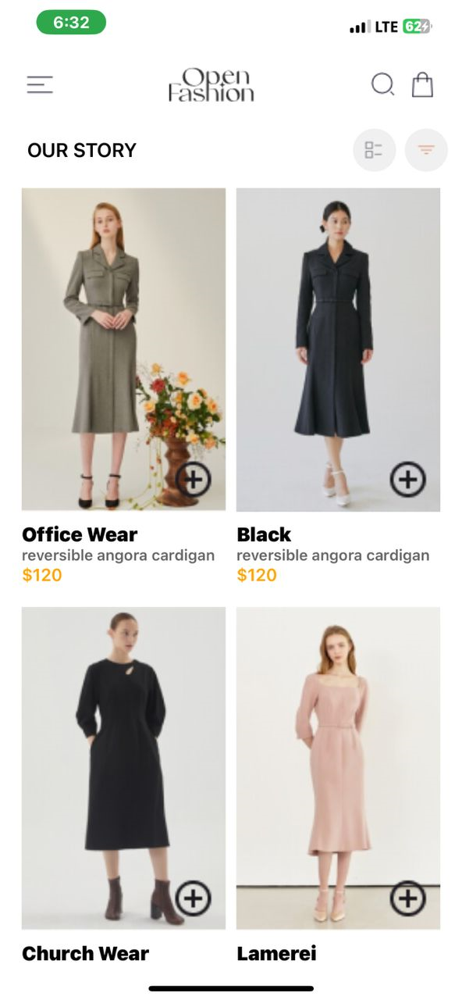
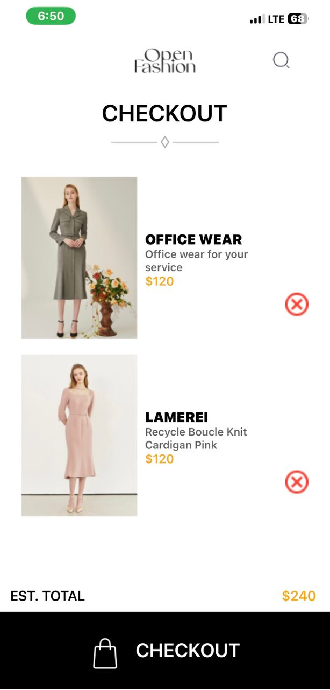

# rn-assignment6-11115960
## Overview
In this assignment, the task was to recreate the design seen in the UI mockup. The design is a simple shopping cart app. The app has two main screens: the Home Screen and the Cart Screen. Users can browse products, add them to their cart, and view the items in their cart.
## App.js
- Navigation: React Navigation is used to handle the transitions between the Home Screen and the Cart Screen.
- StatusBar: This customizes the appearance of the status bar .
## HomeScreen.js
- State Management: useState and useEffect are for managing the cart state and storing it using AsyncStorage.
- Product List: This displays a list of all the products that can be added to the cart.
- Add to Cart: This implements the functionality to add products to the cart and save the state using AsyncStorage.
- Styling: Custom styles were defined using StyleSheet.
## CartScreen.js
- State Management: Uses useState and useEffect to load the cart items from AsyncStorage.
- Remove from Cart: It implements the functionality to remove items from the cart and update the state in AsyncStorage.
- Total Calculation: It is the addition of the prices of all the items in the cart.
## Data Storage
- AsyncStorage: It is used to store the cart state between sessions. In the process of adding or removing items to or from the cart, the updated cart is saved in AsyncStorage.
## Screenshots
 
 
